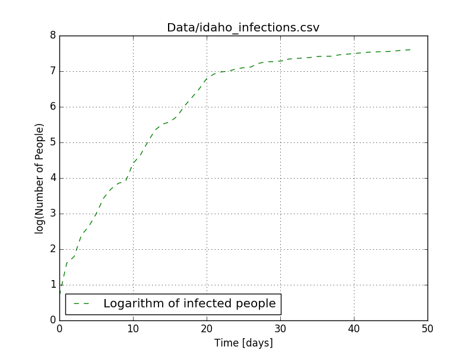
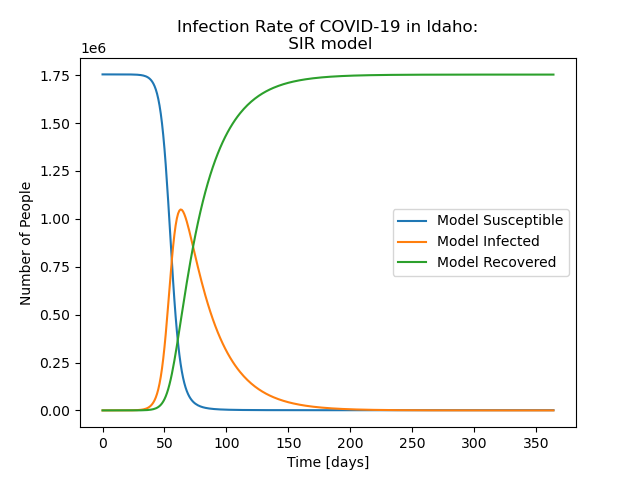

# Overview of Code
The purpose of this code is to describe and model the current coronavirus (COVID-19) pandemic in the state of Idaho. With this, we hope to provide information on how well Idaho is dealing with COVID-19.

It models the pandemic in Idaho as a kinetics function of time in days, with equations that model the uninfected, infected, recovered, and fatalities in Idaho.

# Software Requirements
This code requires access to a command line terminal and to have a github account to access the p2-kinetics repository, for the purpose of collaboration. For this program to run, python must be installed on the local machine. To download Python, go to terminal, type in the command line `apt-get install python`. This will start downloading Python onto the local machine. Your computer will ask a few permission questions and you will have to let it install Python onto the local machine.

The code also requires that numpy, matplotlib.pyplot, sys, and solve_ivp to be imported. All the previously mentioned functions and numpy are part of bash and will run when the code is initiated. 

# How to Get This Code
To run the code on your computer, pull the p2-kinetics repository from github by cloning it or fork the repository and pull the code from your own personal repository. 

## Example of how to get code
1. Go to github.com/mse150s20/p2-kinetics

2. Click on "Clone or download" tab and click on the copy button next to the github address.

3. It is recommended to clone with SSH.

4. In your own terminal enter: `$ git clone git@github.com:mse150s20/p2-kinetics.git`

The directory and all it's contents should now be cloned to your machine. 

# How to Use This Code

To use this code you must be in the "p2-kinetics" directory that contains the code.
Once in the "p2-kinetics" directory type "$ python plot-infections.py" + the path to the file to the .csv file containing the data to be evaluated. 

# Example of how to use this code
Enter the following lines in your terminal:

`$ cd p2-kinetics/`

`$ python plot-infections.py Data/idaho_infections.csv`
OR
`$ python Real_Data.py Data/idaho_infections.csv`

A plot will appear if everything is working correctly.

## Figures Showing Code Output

A graph that displays a model of the data that has already been collected.

A graph that displays the collected data.

A graph that displays the collected data in a logarithmic format.

A graph that displays the model of the data.
# File Descriptions

### Images
The Images Directory is the place where all the graphs are saved to so they are in a centeralized location.

### Data
The data directory contains text files and .csv files from group research sources. Our working model pulls data from this directory when generating our model.
idaho_infections.csv is one example of the files contained in this directory. The idaho_infections.csv file contains the reported numbers of the total reported infections, fatalities, and recoveries in Idaho. The file starts on March 13th, the first day of reported cases in the state. It also includes the number of new cases of each designation. This csv file works in conjunction with Model_VS_Real_Data.py as it will show the comparison of the reported data alongside the projected data of the model. 

### General_Playing
The General_Playing directory contains several working models to be manipulated in order to determine the best fit for the k1 and k2 values of the final predictive model. These models cover varying infection rates, recovery rates, and comparisons to the current to-date data from our sources.  

### finding.py - Still needs defined

### plot-infections.py
When pulling from Data/idaho_infections.csv, this graph plots actual numbers of infections and fatalities in the state of Idaho from day 0, as the first person was infected, to most current update of covid-19 statistics.

### Real_Data.py

### Contributors.txt
Lists all contributors to the project with contact info. 

## Project Info
Project 2 descriptions:
    Modeling kinetics: rate of change between things!

    Healthy -> Infected -> Recovered

The rates of change between Healthy->Infected and Infected->Recovered will show us how quickly COVID-19 spreads and how quickly people are recovering.

The equation for finding how many new infections per day is (rInfect\*Healthy\*Infected)/(Healthy+Infected+Recovered). Applying this tells us that initially when almost everyone is Healthy and very few are infected, the growth of infection is very slow. When Healthy and Infected numbers are equal to each other, the growth of infected is at its peak.

### Definitions

Healthy: This is how many healthy, uninfected people there are in Idaho.

Infected: This is the number of documented COVID-19 positive people there are in Idaho.

Recovered: This is the number of people who have recovered from a COVID-19 infection.

rInfect: This is a constant that is multiplied by the number of Healthy people. The product of Healthy times rInfect gives us the number of new Infections per day.

rRecover: This is a constant that is multiplied by the number of Infected people. The product of Infected time rRecover gives us the number of new Recovered people per day.
The rate at which people recover is completely dependent on how many infected people there are thus the equation for new Recovered is (rRecovered\*Infected). Applying this information tells us as the number of Infected people goes up, the number of new Recovered people will also go up. The peak of Recoveries will be when there the greatest number of Infected people.

# Conclusion
Our data shows a spike in the beginning when we were not prepared or taking the necessary steps to prevent COVID-19 from spreading. Since the social distancing order was put into place, the curve has flattened a little so we should continue to distance as much as possible until we have more information or more people have recovered so we have a better chance of overcoming this virus.

There are a lot of variables to consider when deciding on the future of virus precautions. The idaho_infections.csv data, with our higher k1 variable to more closely represent the standard curve, indicates the virus is not spreading as quickly as predicted. Something else to consider is, due to the likelihood that a vaccine will not be ready within the year, gradual re-introduction of people into society to start building immunity may be the best option.

Due to economic reasons the state of Idaho cannot remain closed until the curve begins to flatten.

Govenor Little of Idaho has introduced a 4-stage plan to reopen the state of Idaho. Each stage is to be carried out at 2-week increments and allow businesses to open up based on category. 

Govenor Little's 4-stage plan to reopen the state of Idaho is a good step towards public re-introduction. As numbers in Idaho have still not peaked we may see an initial increase in the number of confirmed cases. This may reoccur at every stage of reopening as social distancing becomes less prevalent.   

As data continues to collect during this plan our model will capture any impact of this plan. Action can be taken to reduce the speed of reintroduction if infections begin to spiral out of control. 

Personal safety is everyones responsibility and social distancing and good hygiene is strongly encouraged. 

### Results from playing with parameters
The most apparent effect of decreasing k1 was delaying the "ramping up" of the population.

### Visualizing the results of playing with the parameters
Within the General_PLaying Folder, there is a file named "playing.py". By using vim to access this file, the variables k1 and k2 can be changed. From there the playing.py file can be graphed using the python command. The results of this graph will display the day in which there are the maximum number of cases. The color bar on the side can be used to indicate what conditions of k1 and k2 will produce the days of maximum cases.

### Playing team findings - NEED TO ELABORATE ON k1 and k2
A higher k1 is required to get the infection to ramp up in a similar timeframe to the real infections (i.e. smaller k1 = later beginning of mass infection). However, a k2 is needed to control the k1; it can't be too big or too small as to squash the infected graph or to let it grow exponentially large. Finer tuning needed.

As it stands the way that the graphs are generated it is not likely we will be able to make an accurate model. The data is still too young, and has too many outside factors; the current trend of the infections also does not match up with the form that the model graph takes.  

# References
1. Idaho Division of Public Health
   website:  https://public.tableau.com/profile/idaho.division.of.public.health#
  * This source contains data on the statewide cases in Idaho. It contains information on recovered, hospitalized, ICU admittances, and cases among health care workers. It also contains data on COVID-19 demographics and county data.

2. New York Times GitHub Repo
   website https://raw.githubusercontent.com/nytimes/covid-19-data/master/us-states.csv
  * a csv file from New York Times github respository that details the COVID-19 infections and deaths by date and state. 

3. Idaho Statesman
   website: https://www.idahostatesman.com/news/coronavirus/article242127516.html
  * This article by the Idaho Stateman provides a recent chart of new virus cases vs. confirmed cases in Idaho, as of May 13th, 2020, as well as providing demographics of the majority groups that are being affected, and in what counties. This provides insight into how population denisty and relative exposure to the virus in a given profession can influence infection/death rates.

4. KTVB 7
   website: https://www.ktvb.com/article/news/health/coronavirus/idaho-confirms-first-covid-19-coronavirus-case/277-262de30b-ef00-40a2-b40e-43e26f0bb99b
  * This article by KTVB 7 provides a visual representation of the spread of the virus in Idaho with an interactive map and timelines. Numbers of confirmed cases, deaths, and recoveries are displayed by county on a map as well as on a timeline, showing the curves for each situation to more easily visualize how many people are recovering/dying once infected. 

5. Centers for Disease Control and Prevention
   website: https://www.cdc.gov/coronavirus/2019-ncov/cases-updates/summary.html#:~:text=On%20March%2011%2C%20the,of%20novel%20influenza%20viruses.
  * The CDC provides one of the most up to date information regarding the COVID-19 situation in the United States. It provides recommendations for what individuals and businesses should do as well as information on the risk and severity of COVID-19

6. University of Michigan - Health Lab Blog  
   website: https://labblog.uofmhealth.org/rounds/how-scientists-quantify-intensity-of-an-outbreak-like-covid-19
  * A blog post that explains the term R0 and its context in epidemiology and the current COVID-19 pandemic.

7. John Hopkins Whiting School of Engineering github repository
   website:  https://github.com/CSSEGISandData/COVID-19/blob/master/csse_covid_19_data/csse_covid_19_time_series/time_series_covid19_confirmed_US.csv
  * This repository is the data that John Hopkins has gathered about the COVID-19 pandemic in the United States. 

8. New York Times
   website: https://www.nytimes.com/interactive/2020/us/idaho-coronavirus-cases.html
  * This article has COVID-19 related data about Idaho and its counties.

9. John Hopkins University and Medicine
   website: https://coronavirus.jhu.edu/us-map
  * A map of COVID-19 cases and related data on a global scale, country scale, state, and counties.

10. Medium: Towards Data Science
  a. https://towardsdatascience.com/infectious-disease-modelling-part-i-understanding-sir-28d60e29fdfc
  b. https://towardsdatascience.com/infectious-disease-modelling-beyond-the-basic-sir-model-216369c584c4
  c. https://towardsdatascience.com/infectious-disease-modelling-fit-your-model-to-coronavirus-data-2568e672dbc7
    * A collection of articles that explains the background behind SIR modelling and how it models the current COVID-19 pandemic. 
  d. https://github.com/hf2000510/infectious_disease_modelling/blob/master/part_two.ipynb0
    * A github repository that contains the modelling data that was used in the articles to help explain the SIR model.

11. International Journal of Infections Diseases
    website: https://www.ijidonline.com/article/S1201-9712(20)30182-X/fulltext
   * A journal article that details the transmissibility and mortality of COVID-19 in Europe
 
12. Institute for Health Metrics and Evaluation
    website: https://covid19.healthdata.org/united-states-of-america/idaho
   * This website provide plots of reported and projected number of deaths and hospital resources used in the state of Idaho.
 
13. Covid Act Now
    website: https://covidactnow.org/us/id
   * Another website that provides additional information on COVID-19 infections rates and projections in the state of Idaho and the strain on hospitals.
 
14. Our World in Data
    website: https://ourworldindata.org/coronavirus
   * A series of plots that show the total global death toll from COVID-19 and the comparisons between countries. 

15. Science Direct
    website: https://www.sciencedirect.com/science/article/pii/S1286457920300265
   * A scientific article that compares the transmission and mortality of COVID-19 to other diseases. 
